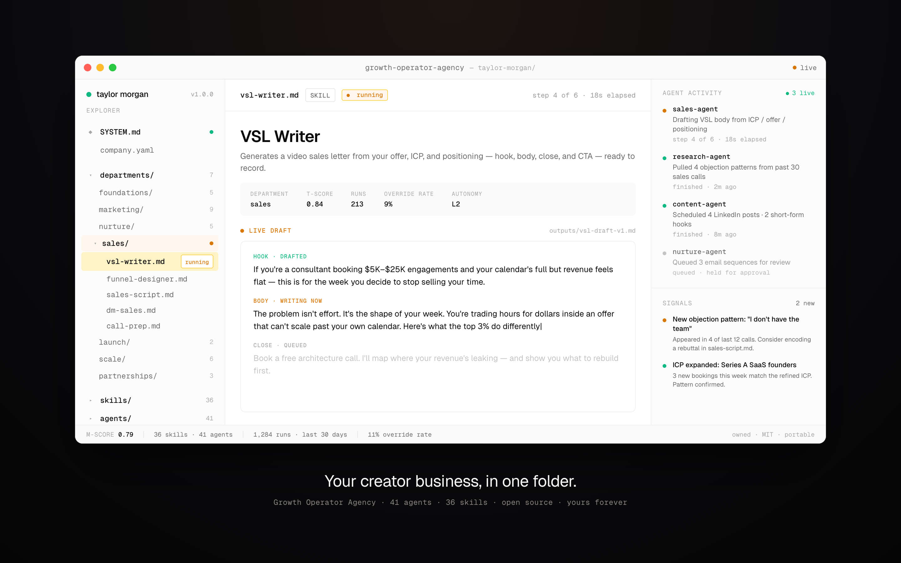
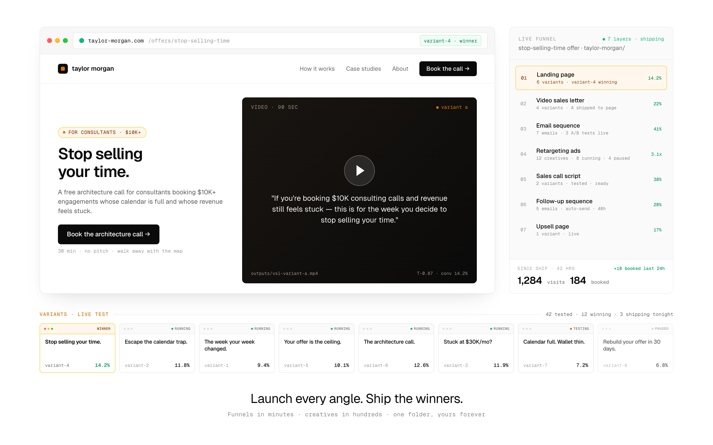

<div align="center">

<h1>Growth Operator Agency</h1>

<p><strong>Launch every angle. Ship the winners.</strong></p>

<p>
  <a href="CHANGELOG.md"></a>
  <a href="LICENSE"></a>
</p>

</div>

<br/>



<p align="center"><em>Your creator business, in one folder.</em></p>

<br/>

A folder of **41 agents and 36 skills** that produces every document a high-ticket creator business runs on — landing pages, video sales letters, email sequences, ads, sales scripts, launch plans, team SOPs.

You fill in the context once. AI writes the documents. You review, approve, ship.

**Launch funnels in minutes. Launch creatives in hundreds. Test every angle.**

No subscription. No signup. No platform to learn. A folder you own, forever.

## Try it

1. Clone:

   ```bash
   git clone https://github.com/Heuresis/Growth-Operator-Agency.git
   ```

2. Fill in `company.yaml` with your business context.

3. Ask for what you need:

   ```
   /research          a market research brief
   /build-icp         a customer profile
   /design-offer      an offer document
   /build-landing     a landing page
   /build-vsl         a video sales letter
   /launch-funnel     a 7-layer funnel
   /generate-ads      hundreds of ad variants
   /plan-launch       a launch plan
   ```

Works with Claude, ChatGPT, Cursor, or any AI tool that reads files.

Full setup: **[Quickstart](docs/QUICKSTART.md)** · 30 minutes.

## Every layer of the funnel. Every angle tested.



<p align="center"><em>Launch every angle. Ship the winners.</em></p>

<br/>

Each offer ships with:

- **Landing page** — multiple variants, live A/B tested
- **Video sales letter** — embedded in the landing page, scripted from your ICP and offer
- **Email sequence** — 7 emails, scheduled across LinkedIn, X, and email
- **Retargeting ads** — hundreds of creatives, tested by angle
- **Sales call script** — tuned on objection patterns captured from your calls
- **Follow-up sequence** — triggered 48 hours after the call
- **Upsell page** — shipped once the funnel proves out

Every action leaves a receipt. Every variant tracks its own conversion. Every winner gets promoted. Every paused variant tells you why.

## What you get

**7 departments. 41 agents. 36 skills.**

- **Foundations** — research · ICP · niche · offer · brand voice
- **Marketing** — content · YouTube · short-form · X · LinkedIn · stories · paid ads · SEO · podcast
- **Nurture** — email sequences · lead magnets · community · webinars · SMS
- **Sales** — VSL · funnel · sales scripts · DM sales · call prep · proposal · CRM
- **Launch** — launch manager · post-launch analyst
- **Scale** — SOPs · team hiring · competitor intel · financial · retention · case studies
- **Partnerships** — JV webinars · affiliate · referral

Built from the playbooks of operators who've run this at scale.

## Documentation

- [Quickstart](docs/QUICKSTART.md) — setup in 30 minutes
- [Architecture](docs/ARCHITECTURE.md) — how the folder is built
- [Skill Authoring](docs/SKILL_AUTHORING.md) — write your own agents and skills

## License

MIT. Free forever.

Built by [Syed Hussain](https://heuresis.ai) at [Heuresis](https://heuresis.ai).
