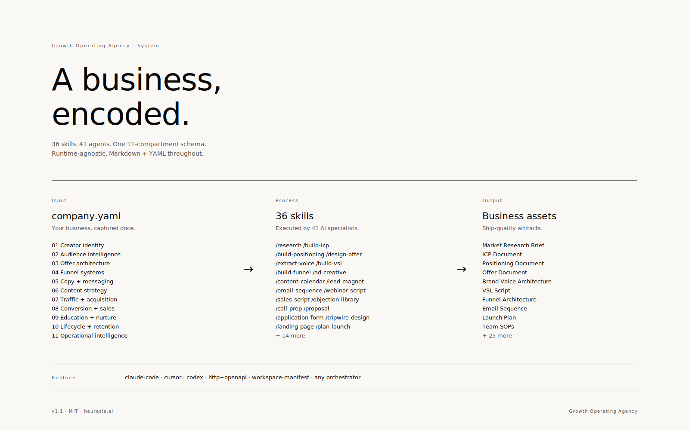
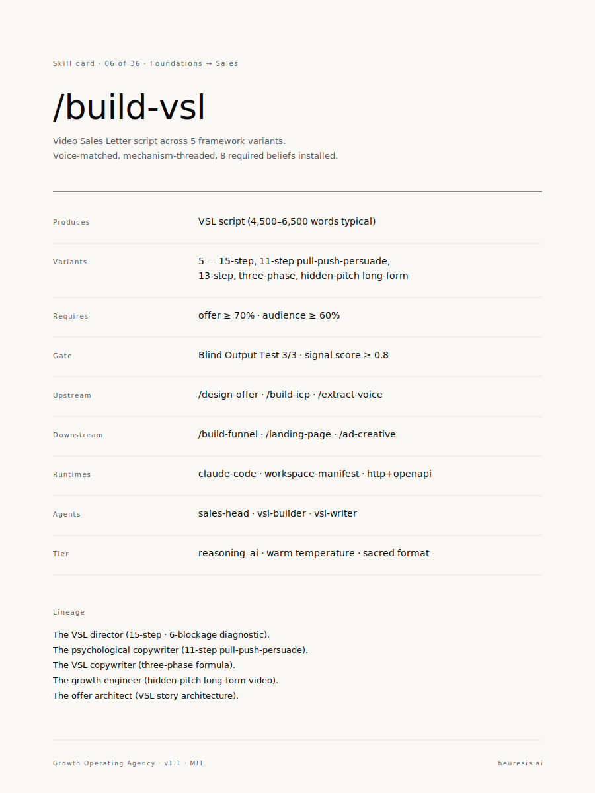
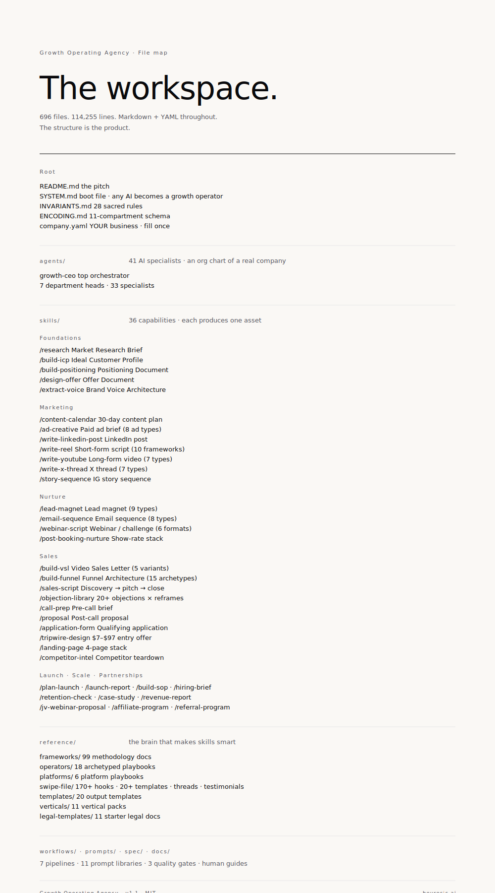

<div align="center">

# **GROWTH OPERATING AGENCY**

**A creator business, run by agents. In one folder.**

<p>
  <a href="CHANGELOG.md"></a>
  <a href="LICENSE"></a>
</p>

</div>

<br/>



<br/>

An open-source workspace of 41 agents organized into 7 departments — Foundations, Marketing, Nurture, Sales, Launch, Scale, Partnerships — that run the operations of a high-ticket creator business.

You fill in the context. The agents execute. You stay in the loop only where your judgment counts.

**Every cycle, the folder runs more of the work.**

No subscription. No signup. No platform to learn. A folder you own, forever.

## Try it

1. Clone:

   ```bash
   git clone https://github.com/Heuresis/Growth-Operator-Agency.git
   ```

2. Fill in `company.yaml` with your business context.

3. Call a department or invoke a skill:

   ```
   /research          → market research brief
   /build-icp         → customer profile
   /design-offer      → offer document
   /build-vsl         → video sales letter
   /plan-launch       → 5-phase launch plan
   ```

Works with Claude Code, Cursor, Aider, ChatGPT, Paperclip, or any agent runtime that reads markdown.

Full setup: **[Quickstart](docs/QUICKSTART.md)** · 30 minutes.

## Inside the workspace

**7 departments. 41 agents. 29 skills.**

- **Foundations** — research · ICP · niche · offer · brand voice
- **Marketing** — content · YouTube · short-form · X · LinkedIn · stories · paid ads · SEO · podcast
- **Nurture** — email sequences · lead magnets · community · webinars · SMS
- **Sales** — VSL · funnel · sales scripts · DM sales · call prep · proposal · CRM
- **Launch** — launch manager · post-launch analyst
- **Scale** — SOPs · team hiring · competitor intel · financial · retention · case studies
- **Partnerships** — JV webinars · affiliate · referral

Built from the playbooks of operators who've run this at scale.

## Every skill is specced

Each of the 36 capabilities ships with the same contract: required inputs, variants, gates, runtime adapters. One example:



## The map



Full annotated tree: [docs/FILE-TREE.md](docs/FILE-TREE.md)

## Documentation

- [Quickstart](docs/QUICKSTART.md) — setup in 30 minutes
- [Architecture](docs/ARCHITECTURE.md) — how the folder is built
- [Skill Authoring](docs/SKILL_AUTHORING.md) — write your own agents and skills

## License

MIT. Free forever.

Built by [Syed Hussain](https://heuresis.ai) at [Heuresis](https://heuresis.ai).
