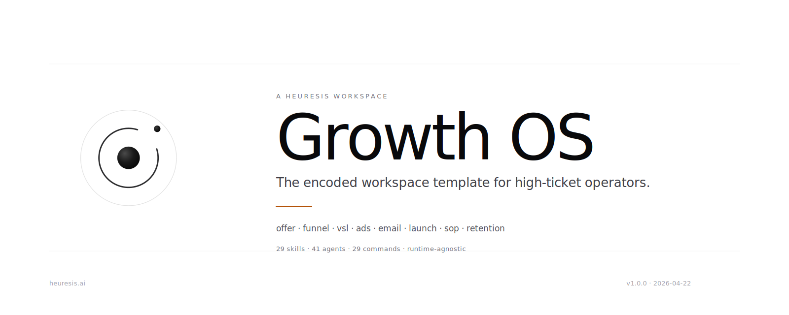

<div align="center">

<picture>
  <source media="(prefers-color-scheme: dark)" srcset="docs/assets/hero-banner-dark.svg">
  
</picture>

<br/>

[](CHANGELOG.md)
[](LICENSE)
[](spec/RUNTIMES.md)
[](skills/_INDEX.md)
[](agents/_INDEX.md)
[](PROVENANCE.md)

<br/>

**The encoded workspace template for creators, coaches, consultants, and founders launching and scaling high-ticket offers.**

Not a chatbot. Not a SaaS. Not a platform.
Files on disk that you own — skills and agents that run on any LLM that reads markdown and YAML.

<br/>

[Quickstart](docs/QUICKSTART.md) · [Architecture](docs/ARCHITECTURE.md) · [Skill Authoring](docs/SKILL_AUTHORING.md) · [Glossary](docs/GLOSSARY.md) · [FAQ](docs/FAQ.md)

</div>

<br/>

---

## The thesis

> **Workspace = ROM. Agent = RAM. Skills are stacked.**

- **Workspace = ROM.** Persistent, transferable, version-controlled. Files on disk. Yours forever.
- **Agent = RAM.** Stateless, generic, replaceable. Any agent that reads this workspace becomes a specialist in your business.
- **Skills are stacked.** Deterministic procedures that produce specific assets. Rigid, versioned, testable.

Most go-to-market AI fails because the underlying business is never encoded. Growth OS encodes the business first. The agent runs on top of something real.

<br/>

<div align="center">

<picture>
  <source media="(prefers-color-scheme: dark)" srcset="docs/assets/architecture-dark.svg">
  
</picture>

</div>

<br/>

---

## What ships in v1.0.0

| Layer | Content | Status |
|---|---|---|
| Boot | `SYSTEM.md` · `INVARIANTS.md` · `ENCODING.md` · `company.yaml` · `.env.template` | shipped |
| Skills | 29 runtime-agnostic skills, each with `SKILL.md` + adapters + evidence scaffolding | shipped |
| Agents | 41 agents (1 director · 7 division leads · 33 specialists) | shipped |
| Spec | 8 files — Signal Theory, Quality, Runtimes, Banned Vocabulary, Blind Output Test, Context Thresholds, Integrations, HTTP/OpenAPI | shipped |
| Reference | Frameworks, operators, platforms, swipe-file, templates, examples, FIOVA-AGENT-ARCHITECTURE | shipped |
| Workflows | 7 division FSMs, client onboarding, delivery, execution templates, 5 automations | shipped |
| Operations | Team leadership, collaboration, cadences, finance, hiring, tool SOPs | shipped |
| Adapters | Claude Code (primary) · Canopy (primary) for all 29 skills | shipped |
| Adapters | HTTP / OpenAPI contract | v1.1 target |
| Adapters | Codex · Cursor · OpenClaw | v2.0 target |

<br/>

---

## The 7 divisions

<div align="center">

<picture>
  <source media="(prefers-color-scheme: dark)" srcset="docs/assets/divisions-dark.svg">
  
</picture>

</div>

<br/>

---

## Install

<details open>
<summary><strong>Option 1 — Claude Code (recommended)</strong></summary>

```bash
git clone <your-private-remote>/growth-os.git your-creator-workspace
cd your-creator-workspace
```

Open the workspace in Claude Code. The harness auto-reads `.claude/commands/*.md` and exposes 29 slash commands. The first agent to enter reads `SYSTEM.md` → `INVARIANTS.md` → `ENCODING.md` → `company.yaml` as its boot sequence.

</details>

<details>
<summary><strong>Option 2 — Canopy runtime</strong></summary>

```bash
cp -R growth-os ~/canopy-workspaces/growth-os
canopy boot ~/canopy-workspaces/growth-os
```

Canopy discovers skills by scanning `skills/*/SKILL.md`. Each skill has a Canopy adapter at `skills/{slug}/adapters/canopy.yaml` declaring SORX runtime metadata, role affinity, evidence gates, and signal tuple.

</details>

<details>
<summary><strong>Option 3 — any generic LLM</strong></summary>

1. Paste `SYSTEM.md` into a new conversation as the system prompt.
2. Paste the relevant `company.yaml` compartments as context.
3. Invoke a skill by pasting its `SKILL.md` body and following the Process section.

This is the **portability guarantee**. Every skill must work this way — [INV-10](INVARIANTS.md).

</details>

<br/>

---

## Quick start

Run the Foundations chain first. Every other division depends on it.

```
/research → /build-icp → /build-positioning → /design-offer → /extract-voice
```

| Step | Command | Prerequisite | Time |
|---|---|---|---|
| 1 | `/research` | Willingness to be interviewed | 30–90 min |
| 2 | `/build-icp` | Audience ≥ 30% | 15–30 min |
| 3 | `/build-positioning` | Audience ≥ 60% | 30–60 min |
| 4 | `/design-offer` | Audience ≥ 70% · Offer ≥ 30% · 3:1 LTV:CAC | 45–90 min |
| 5 | `/extract-voice` | Creator historical content available | 30–60 min |

The output of step N is the input of step N+1. Skills self-gate — below the threshold, the skill refuses and asks you to run the upstream skill first.

Full walkthrough in [**docs/QUICKSTART.md**](docs/QUICKSTART.md).

<br/>

---

## The encoding flywheel

<div align="center">

<picture>
  <source media="(prefers-color-scheme: dark)" srcset="docs/assets/flywheel-dark.svg">
  
</picture>

</div>

Every cycle deepens the encoding. Every run makes the next run cheaper, faster, and closer to voice. The compounding gap to un-encoded operators widens monthly.

<br/>

---

## Skill anatomy

<div align="center">

<picture>
  <source media="(prefers-color-scheme: dark)" srcset="docs/assets/skill-anatomy-dark.svg">
  
</picture>

</div>

Every skill is a folder. One runtime-agnostic canonical (`SKILL.md`). Four supporting directories. One binding per runtime. A skill written today runs unchanged on any runtime that reads markdown and YAML.

Authoring contract in [**docs/SKILL_AUTHORING.md**](docs/SKILL_AUTHORING.md).

<br/>

---

## Repository shape

```
growth-os/
├── SYSTEM.md                  ← identity + boot sequence
├── INVARIANTS.md              ← 14 sacred rules (always enforced)
├── ENCODING.md                ← 11-compartment Creator Context Profile schema
├── company.yaml               ← your actual context (fill this in)
├── .env.template              ← credential template
│
├── agents/                    ← 41 thin personas with reporting chain
├── skills/                    ← 29 deterministic skills, each a folder
├── spec/                      ← 8 files — quality gates, signal, runtimes, thresholds
├── workflows/                 ← FSMs per division + execution templates
├── handoffs/                  ← phase-transition contracts
├── operations/                ← team cadences + SOPs
│
├── reference/                 ← frameworks, operators, platforms, swipe-file, templates
│   └── FIOVA-AGENT-ARCHITECTURE.md  ← 82KB architecture bible
│
├── docs/                      ← quickstart, architecture, glossary, FAQ, assets
├── .claude/commands/          ← 29 Claude Code slash command bindings
├── .github/                   ← issue templates, PR template, CODEOWNERS
│
├── output/                    ← generated artifacts (gitignored)
├── _private/                  ← encoded creator data (gitignored per INV-11)
└── _excluded/                 ← opt-out register
```

<br/>

---

## Foundations

Growth OS rests on three load-bearing layers:

1. **Signal Theory** — the quality substrate. Every output is a Signal encoded as a 5-tuple and measured against an S/N ratio.
2. **Encoded Founder methodology** — the decision logic for translating tacit creator judgment into machine-readable content.
3. **Canopy Protocol** — the workspace file contract that makes every skill runtime-agnostic.

Full provenance, authorship, and what-Heuresis-owns-vs-does-not in [**PROVENANCE.md**](PROVENANCE.md).

<br/>

---

## Privacy

Growth OS enforces a hard split between **template structure** (shippable) and **encoded creator content** (never shippable).

- `company.yaml` (once filled), `_private/`, `output/`, and `.env.local` are gitignored by default.
- The template structure is the Heuresis product. The encoded data is the creator's IP.
- When forking for a new creator, reset `company.yaml` to the empty-template form and start `_private/` and `output/` empty.

[INV-11](INVARIANTS.md) is load-bearing. Every contributor verifies the split before each push.

Full contract in [**SECURITY.md**](SECURITY.md).

<br/>

---

## Documentation

| Doc | What it covers |
|---|---|
| [Quickstart](docs/QUICKSTART.md) | First run in 30 minutes |
| [Architecture](docs/ARCHITECTURE.md) | Three-layer knowledge model, 11 compartments, 14 invariants, Signal Theory |
| [Skill Authoring](docs/SKILL_AUTHORING.md) | How to author or modify a skill |
| [Glossary](docs/GLOSSARY.md) | Every term, in one place |
| [FAQ](docs/FAQ.md) | Common questions on install, runtimes, privacy, instantiation |
| [Contributing](CONTRIBUTING.md) | Internal contribution workflow and quality gates |
| [Security](SECURITY.md) | Credential handling, `_private/` data contract, vulnerability reporting |
| [Changelog](CHANGELOG.md) | Version history |
| [Provenance](PROVENANCE.md) | Authorship and foundational sources |

<br/>

---

## Status

v1.0.0 — initial private release — 2026-04-22.

Growth OS is the first Heuresis workspace template shipping under the Heuresis brand. See [CHANGELOG.md](CHANGELOG.md) for the full v1.0.0 scope and known next steps.

<br/>

---

## License

Private. All rights reserved. See [LICENSE](LICENSE).

<br/>

<div align="center">

<picture>
  <source media="(prefers-color-scheme: dark)" srcset="docs/assets/heuresis-mark-dark.svg">
  
</picture>

<br/>
<br/>

**Workspace = ROM. Agent = RAM. Skills are stacked.**

<sub>Made by Heuresis — [heuresis.ai](https://heuresis.ai)</sub>

</div>
