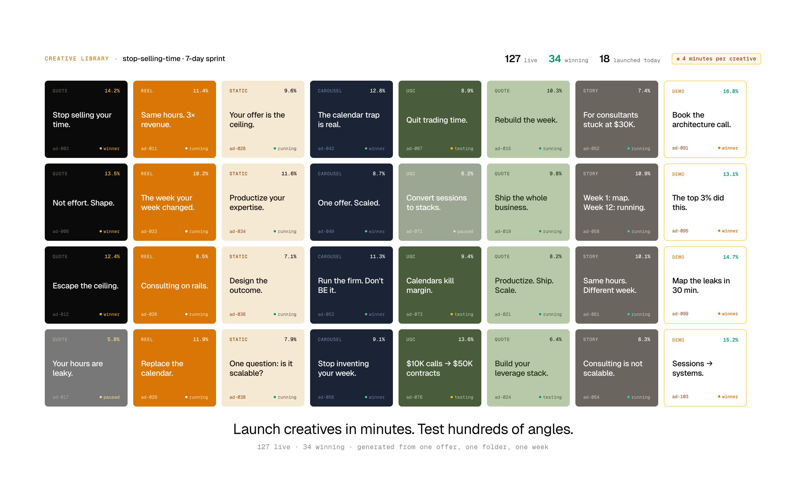

<div align="center">

<picture>
  <source media="(prefers-color-scheme: dark)" srcset="docs/assets/heuresis-logo-dark.png">
  <source media="(prefers-color-scheme: light)" srcset="docs/assets/heuresis-logo-light.png">
  
</picture>

<br/>
<br/>

<h1>Growth Operator Agency</h1>

<p><strong>A team of agents running your creator business.</strong></p>

<p>
  <a href="CHANGELOG.md"></a>
  <a href="LICENSE"></a>
</p>

</div>

<br/>


<p align="center"><em>Your creator business, in one folder.</em></p>

<br/>

> **The agent is thin. The workspace is smart. The workspace IS the product.**

A team of AI agents running every department of your creator business. Each agent carries *your* judgement. Your pricing logic. Your sales scripts. Your quality standards.

Not workflow automation. Encoded intent. The agents don't just follow rules — they make decisions the way you would, read signals the way you read them, and get sharper every cycle.

You stay in the loop where your judgement counts. The rest runs while you sleep.

## Try it

1. Clone:

   ```bash
   git clone https://github.com/Heuresis/Growth-Operator-Agency.git
   ```

2. Fill in `company.yaml` with your business context.

3. Ask for what you need:

   ```
   /research          a market research brief
   /build-icp         a customer profile
   /design-offer      an offer document
   /build-landing     a landing page
   /build-vsl         a video sales letter
   /launch-funnel     a 7-layer funnel
   /generate-ads      hundreds of ad variants
   /plan-launch       a launch plan
   ```

Works with Claude, ChatGPT, Cursor, or any AI tool that reads files.

Full setup: **[Quickstart](docs/QUICKSTART.md)** · 30 minutes.

## What's inside the folder

```text
growth-operator-agency/
│
├── README.md            ←  the pitch
├── SYSTEM.md            ←  boot file · any AI becomes a growth operator
├── INVARIANTS.md        ←  28 sacred rules
├── ENCODING.md          ←  11-compartment schema
├── company.yaml         ←  YOUR business · fill once
│
├── agents/              ←  41 AI specialists · an org chart of a real company
│      growth-ceo               top orchestrator
│      7 department heads  ·  33 specialists
│
├── skills/              ←  36 capabilities · each produces one asset
│   │
│   │   FOUNDATIONS
│   ├── /research                 Market Research Brief
│   ├── /build-icp                Ideal Customer Profile
│   ├── /build-positioning        Positioning Document
│   ├── /design-offer             Offer Document
│   └── /extract-voice            Brand Voice Architecture
│   │
│   │   MARKETING
│   ├── /content-calendar         30-day content plan
│   ├── /ad-creative              Paid ad brief (8 ad types)
│   ├── /write-linkedin-post      LinkedIn post
│   ├── /write-reel               Short-form script (10 frameworks)
│   ├── /write-youtube            Long-form video (7 types)
│   ├── /write-x-thread           X thread (7 types)
│   └── /story-sequence           IG story sequence
│   │
│   │   NURTURE
│   ├── /lead-magnet              Lead magnet (9 types)
│   ├── /email-sequence           Email sequence (8 types)
│   ├── /webinar-script           Webinar / challenge (6 formats)
│   └── /post-booking-nurture     Show-rate stack
│   │
│   │   SALES
│   ├── /build-vsl                Video Sales Letter (5 variants)
│   ├── /build-funnel             Funnel Architecture (15 archetypes)
│   ├── /sales-script             Discovery → pitch → close
│   ├── /objection-library        20+ objections × reframes
│   ├── /call-prep                Pre-call brief
│   ├── /proposal                 Post-call proposal
│   ├── /application-form         Qualifying application
│   ├── /tripwire-design          $7–$97 entry offer
│   ├── /landing-page             4-page stack
│   └── /competitor-intel         Competitor teardown
│   │
│   │   LAUNCH  ·  SCALE  ·  PARTNERSHIPS
│   ├── /plan-launch  ·  /launch-report  ·  /build-sop  ·  /hiring-brief
│   ├── /retention-check  ·  /case-study  ·  /revenue-report
│   └── /jv-webinar-proposal  ·  /affiliate-program  ·  /referral-program
│
└── reference/           ←  the brain that makes skills smart
    ├── frameworks/             99 methodology docs
    ├── operators/              18 archetyped playbooks
    ├── platforms/              6 platform playbooks
    ├── swipe-file/             170+ hooks · templates · threads · testimonials
    ├── templates/              20 output templates
    ├── verticals/              11 vertical packs
    └── legal-templates/        11 starter legal docs
```

Each file is plain text. Each folder is owned by you. Nothing is locked behind an app.

## Every layer of the funnel. Every angle tested.



<p align="center"><em>Launch every angle. Ship the winners.</em></p>

<br/>

Each offer ships with:

- **Landing page** — multiple variants, live A/B tested
- **Video sales letter** — embedded in the landing page, scripted from your ICP and offer
- **Email sequence** — 7 emails, scheduled across LinkedIn, X, and email
- **Retargeting ads** — hundreds of creatives, tested by angle
- **Sales call script** — tuned on objection patterns captured from your calls
- **Follow-up sequence** — triggered 48 hours after every call
- **Upsell page** — shipped once the funnel proves out

Every action leaves a receipt. Every variant tracks its own conversion. Every winner gets promoted. Every paused variant tells you why.

## Runs while you sleep

Wire the workspace into a runtime with **cron, webhook, and event triggers**. The agents keep working without you in the room.

- **Monday 09:00 (cron)** — retention-agent runs a health check on every active client
- **On `lead.captured` (webhook)** — ICP-match scoring fires, nurture sequence routed
- **On `launch.cart.closed` (event)** — launch-report generated within 48 hours
- **Daily 06:00 (cron)** — content-agent queues 4 LinkedIn posts, 2 short-form hooks
- **Continuous (event)** — retargeting-agent swaps creatives based on CTR

Triggers are declared in [`paperclip.manifest.yaml`](paperclip.manifest.yaml). Wire them to your scheduler and the workspace operates as a 24/7 growth team.

## What you get

**7 agent-first departments. 41 agents. 36 skills.**

- **Foundations** — research · ICP · niche · offer · brand voice
- **Marketing** — content · YouTube · short-form · X · LinkedIn · stories · paid ads · SEO · podcast
- **Nurture** — email sequences · lead magnets · community · webinars · SMS
- **Sales** — VSL · funnel · sales scripts · DM sales · call prep · proposal · CRM
- **Launch** — launch manager · post-launch analyst
- **Scale** — SOPs · team hiring · competitor intel · financial · retention · case studies
- **Partnerships** — JV webinars · affiliate · referral

Each department is not a set of rules. Each is a full department rebuilt as agent-first — agents that carry your intent, read signals, and make decisions.

## Runs in any compatible agent runtime

The workspace is files. Files run anywhere that reads files.

- **[Paperclip](https://github.com/paperclip-dev/paperclip)** — open-source agentic runtime with cron, webhook, and event triggers
- **Claude** · **ChatGPT** · **Cursor** — interactive sessions and slash-command execution
- **Claude Agent SDK** — API-driven orchestration
- **BusinessOS** — desktop operating environment for operator teams
- Any HTTP orchestrator that speaks OpenAPI

Runtime-swappable. Your workspace is the asset. The runtime is replaceable.

## Why this matters

Every founder-led creator business eventually hits the same wall: the founder IS every department. The firm stops when the founder stops.

Encoding changes the shape of the week. Your expertise — pricing logic, qualification instincts, quality standards, the patterns you carry in your head — gets written into agents that run each department on your judgement. The founder stays. The judgement scales. The business compounds.

Every cycle, each department runs it gets sharper. The gap between your firm and every competitor operating off memory widens.

This is the first template in the library. More shipping, vertical by vertical. Every outcome claim we publish traces to a real deployment with a real operator. Thesis, method, and source go public on ideas. Receipts wait their turn.

## Repository layout

| Folder | What it is |
|---|---|
| [`.claude/commands/`](.claude/commands/) | Claude Code slash-command shims — one `.md` per skill, wires `/skill-name` to its runtime |
| [`.github/`](.github/) | GitHub-native config: issue templates, PR template, contribution guide |
| [`agents/`](agents/) | 41 agent role definitions — CEO, 7 department heads, 33 specialists |
| [`docs/`](docs/) | User documentation: quickstart, architecture, FAQ, glossary, file tree, skill authoring guide |
| [`prompts/`](prompts/) | Domain-indexed prompt library: research, sales, content, email, ads, analytics, voice |
| [`reference/`](reference/) | Methodology library: frameworks, operator playbooks, swipe files, templates, vertical playbooks, legal templates |
| [`skills/`](skills/) | 36 skill packages — each with `SKILL.md`, variants, examples, evidence, runtime adapters |
| [`spec/`](spec/) | Workspace specifications: banned vocabulary, context thresholds, runtime contracts |
| [`workflows/`](workflows/) | Operational workflows: client onboarding, division pipelines, automations, handoffs, ops cadences |

## Documentation

- [Quickstart](docs/QUICKSTART.md) — setup in 30 minutes
- [Architecture](docs/ARCHITECTURE.md) — how the folder is built
- [Skill Authoring](docs/SKILL_AUTHORING.md) — write your own agents and skills

## License

MIT. Free forever.

Built by [Syed Hussain](https://heuresis.ai) at [Heuresis](https://heuresis.ai).
