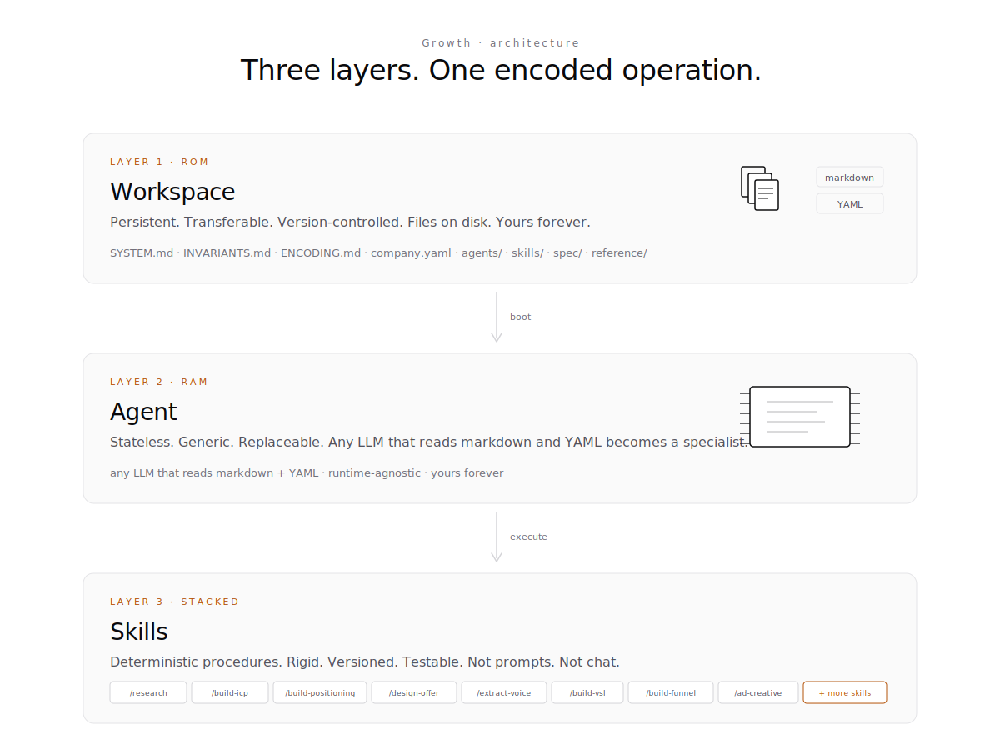
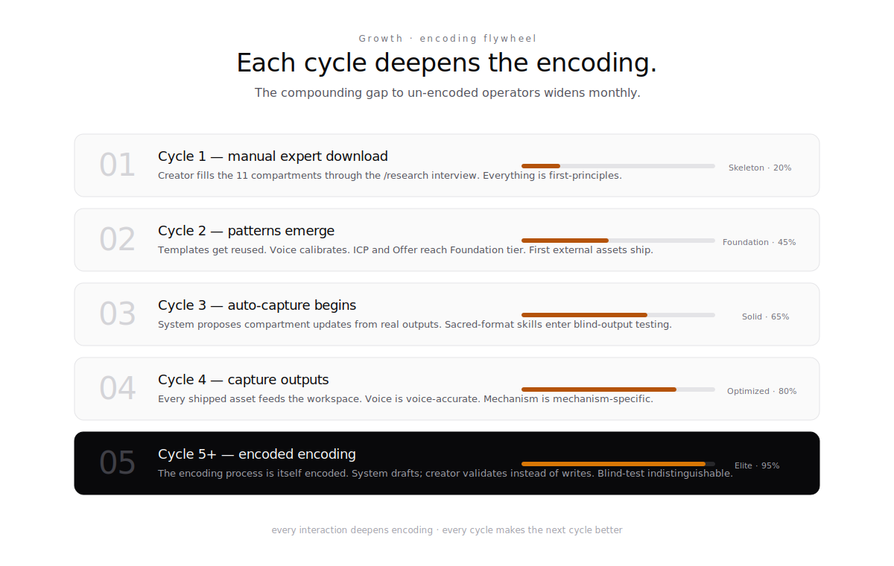
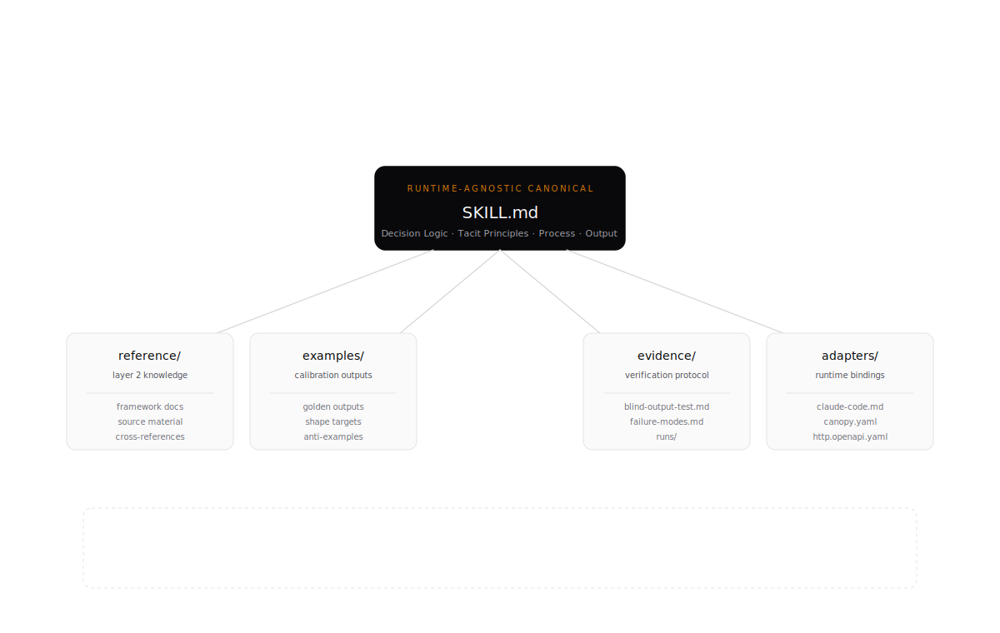
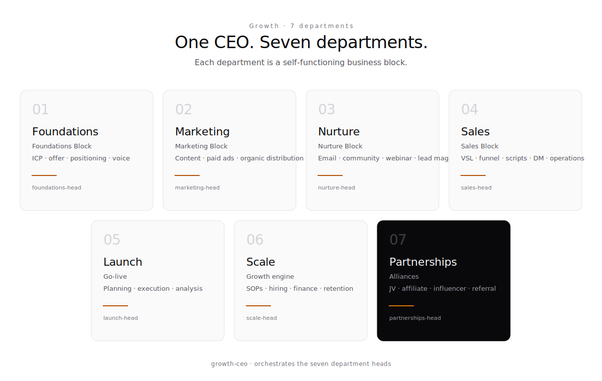

# Architecture

Growth OS encodes a specific thesis: a go-to-market operation for a high-ticket creator business can be expressed as a runtime-agnostic workspace that any capable LLM can execute. This document walks the layers, the invariants, and the flywheel.

<picture>
  <source media="(prefers-color-scheme: dark)" srcset="assets/architecture-dark.svg">
  
</picture>

---

## The three layers

### Layer 1 — Decision Logic (timeless)

The WHY. Judgment, tradeoffs, principles, sacred rules. This layer survives every platform shift.

- Lives in: `skills/{slug}/SKILL.md` (Decision Logic + Tacit Principles sections) and `INVARIANTS.md`.
- Example: "If audience completeness is below 70%, refuse to produce paid-traffic copy and run `/build-icp` first."

### Layer 2 — Structured Knowledge (durable)

The HOW. SOPs, decision trees, templates, pricing matrices, named frameworks. Durable across years, not platforms.

- Lives in: `reference/frameworks/`, `reference/operators/`, `reference/knowledge/`, `reference/templates/`, `reference/swipe-file/`.
- Example: The 15-step VSL structure. The Value Equation. The Pull-Push-Persuade framework.

### Layer 3 — Technology Interface (ephemeral)

The RUNTIME. Tool bindings, file paths, command palette entries, database bindings. Rebuilds when the platform changes.

- Lives in: `skills/{slug}/adapters/{runtime}.{ext}` and `.claude/commands/`.
- Example: `skills/research/adapters/claude-code.md` translates the runtime-agnostic `SKILL.md` into a Claude Code slash command.

This three-layer split is the **Encoded Founder** model in practice. Change the runtime, only Layer 3 rebuilds. Change the methodology, only Layer 2 moves. The Decision Logic is the load-bearing part.

---

## The 11-compartment context profile

Every output Growth OS produces is a function of the Creator Context Profile stored in `company.yaml`. The eleven compartments are weighted per the **Impact Distribution Principle** (40/40/20 — audience drives 40% of results, offer drives 40%, copy drives 20%):

| # | Compartment | Weight | What it holds |
|---|---|---|---|
| 1 | Creator Identity Matrix | 15% | Who the creator is, their voice, their positioning |
| 2 | Audience Intelligence System | **20%** | ICP, market sophistication, voice of customer |
| 3 | Offer Architecture | 15% | Core offers, offer ladder, pricing psychology, unit economics |
| 4 | Funnel Systems | 10% | Active funnels with 5-stage structure |
| 5 | Copy & Messaging | 5% | Proven headlines, hooks, angles, objection handling |
| 6 | Content Strategy Matrix | 5% | Content pillars, platform strategies, bridges to offer |
| 7 | Traffic & Acquisition | 10% | Organic, paid, partnerships |
| 8 | Conversion & Sales Systems | 10% | Sales process, scripts, qualification |
| 9 | Education & Nurture OS | 5% | Onboarding, email sequences, community |
| 10 | Lifecycle & Optimization | 3% | Retention, upsells, metrics dashboard |
| 11 | Operational Intelligence | 2% | Tech stack, team structure, workflows |

Full schema at [`ENCODING.md`](../ENCODING.md). Each compartment maps to specific skills that read from it and write to it.

---

## Context thresholds

The workspace does not produce from null. Every skill declares its required compartment thresholds. Below threshold, the skill refuses to execute and enters Compartment Interview Mode.

| Tier | Completeness | What the workspace can produce |
|---|---|---|
| **Skeleton** | 0–25% | Only general strategic guidance. Request more inputs. |
| **Foundation** | 25–50% | Generic frameworks filled with available context. Flag gaps. |
| **Solid** | 50–75% | Most asset types. Copy with mild stylistic smoothing. |
| **Optimized** | 75–90% | Publish-ready first drafts. Voice-accurate. Mechanism-specific. |
| **Elite** | 90–100% | Outputs indistinguishable from the creator's own. |

Section-specific minimums (examples):

- VSL production: Offer ≥ 70%, Audience ≥ 60%
- Ad creative: Audience ≥ 70%, Offer ≥ 50%
- Sales script: Offer ≥ 70%, Audience ≥ 60%, Sales Systems ≥ 50%

See [`spec/CONTEXT-THRESHOLDS.md`](../spec/CONTEXT-THRESHOLDS.md) for the full gate table.

---

## Sequential dependency

Foundation assets must be built in order. Out-of-order execution produces noise.

```
Market Research Brief → ICP → Positioning → Offer → Offer Repositioning
```

Each step requires the previous step's output. **Offer construction cannot begin without a completed ICP.** No marketing asset can ship without a Brand Voice doc. This is [INV-2](../INVARIANTS.md).

---

## The 14 sacred invariants

Load-bearing rules enforced at every skill invocation. Violation equals reject plus revise. The top five:

1. **Impact Distribution** — always audit Audience → Offer → Copy in that order.
2. **Sequential Dependency** — foundation assets must be built in order.
3. **Context Threshold Gates** — no skill executes without its required compartment completeness.
4. **Economics Validation** — every offer architecture must show a viable path to 3:1 LTV:CAC before downstream marketing ships.
5. **Truth Gate** — every claim must survive the 30-second screenshot test.

Full list in [`INVARIANTS.md`](../INVARIANTS.md). Each invariant has a NEVER clause, an ALWAYS clause, and an enforcement mechanism.

---

## Signal Theory — the quality substrate

Every output Growth OS produces is a **Signal** encoded as a 5-tuple:

```
S = (Mode, Genre, Type, Format, Structure)
```

Unresolved dimensions equal noise. The S/N ratio is measured per output and gated before ship:

- S/N ≥ 0.8 → external / publish-ready
- S/N ≥ 0.5 → internal / usable draft
- S/N < 0.5 → reject plus revise

Signal Theory is the quality substrate. It is not a style guide — it is the information-theoretic backbone that determines whether an output actually lands. See [`spec/SIGNAL.md`](../spec/SIGNAL.md).

---

## Triple-layer verification

Every output passes through three gates before ship:

| Gate | Weight | What it checks |
|---|---|---|
| Formal | 40% | Structure, schema, banned vocabulary, output format compliance |
| Semantic | 35% | Cross-references resolve, compartment citations accurate, mechanism specificity |
| Information-theoretic | 25% | Signal tuple resolved, S/N ≥ gate threshold |

Plus the **Blind Output Test** for ship-worthy assets: three evaluators who know the creator's work answer "Did the creator produce this, or the system?" If at least one says "creator" or "can't tell," the encoding passed. If zero say "creator," revise.

See [`spec/QUALITY.md`](../spec/QUALITY.md) and [`spec/BLIND-OUTPUT-TEST.md`](../spec/BLIND-OUTPUT-TEST.md).

---

## The encoding flywheel

<picture>
  <source media="(prefers-color-scheme: dark)" srcset="assets/flywheel-dark.svg">
  
</picture>

Every cycle through the workspace makes the next cycle better.

1. **Cycle 1 — manual expert download.** Creator fills compartments via interview.
2. **Cycle 2 — patterns emerge.** Templates get reused. Voice calibrates.
3. **Cycle 3 — auto-capture begins.** System proposes compartment updates from real outputs.
4. **Cycle 4 — capture outputs.** Every shipped asset feeds the workspace.
5. **Cycle 5+ — encoded encoding.** The encoding process itself is encoded; creator validates instead of writes.

Every interaction deepens encoding. The compounding gap to un-encoded operators widens monthly. This is the real product — not any single output, but the infrastructure that produces every future output cheaper, faster, and closer to voice.

---

## Skill anatomy

<picture>
  <source media="(prefers-color-scheme: dark)" srcset="assets/skill-anatomy-dark.svg">
  
</picture>

Every skill ships as a folder with one runtime-agnostic canonical (`SKILL.md`) and four supporting directories. Runtime-specific concerns live in `adapters/` — never in `SKILL.md` itself. See [SKILL_AUTHORING.md](SKILL_AUTHORING.md) for the full authoring contract.

---

## Agent routing

Agents are thin personas. Business logic lives in skills, not agents. The routing is:

1. User intent arrives at `growth-director` (orchestrator).
2. Director classifies to a division lead based on the target output.
3. Division lead routes to the specialist that owns the relevant skill.
4. Specialist loads `skills/{slug}/SKILL.md`, checks context thresholds, executes.
5. Output passes through the triple-layer gate.
6. On pass, artifact ships. On fail, handoff per `handoffs/quality-revision.md` (max 2 attempts before creator escalation).

See [`agents/_INDEX.md`](../agents/_INDEX.md) for the full roster and reporting chain.

---

## The 7 divisions

<picture>
  <source media="(prefers-color-scheme: dark)" srcset="assets/divisions-dark.svg">
  
</picture>

---

## Further reading

- [`PROVENANCE.md`](../PROVENANCE.md) — authorship, foundational sources, what Heuresis owns and does not own
- [`SYSTEM.md`](../SYSTEM.md) — the boot file, full routing, full spec catalog
- [`INVARIANTS.md`](../INVARIANTS.md) — the 14 sacred rules
- [`ENCODING.md`](../ENCODING.md) — the 11-compartment schema
- [`spec/`](../spec/) — quality gates, runtimes, integrations

---

*Growth OS — a Heuresis workspace template. [heuresis.ai](https://heuresis.ai)*
