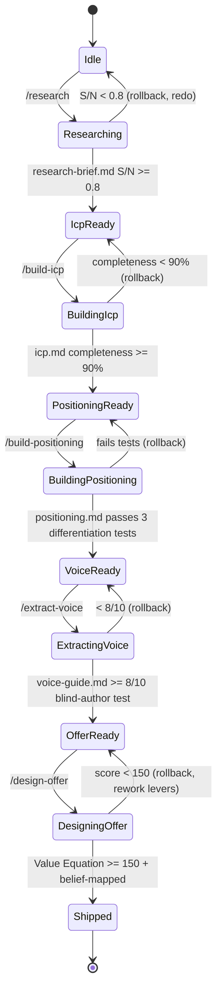

# Foundations Pipeline — FSM

## Purpose
State machine governing the Foundations department. Transitions only occur when the gate for the downstream state is satisfied. A failed gate triggers rollback, not skip.

## State Diagram

## State Definitions

### Idle
No research brief. No ICP. This is the cold-start state for a new client or new offer.
- **Entry:** client onboarded OR offer-retirement triggered foundation reset
- **Exit:** `/research` invoked

### Researching
Active discovery. Capturing 50+ customer-language quotes, pain-tier tagging, market sizing.
- **Entry:** `/research` skill invoked
- **Produces:** `output/foundations/research-brief.md`
- **Exit gate:** Signal-to-Noise ≥ 0.8, Completeness ≥ 90% of fields cited

### IcpReady
Research approved. No ICP document yet. The brief is the input for ICP codification.
- **Entry:** research-brief.md passes gate
- **Exit:** `/build-icp` invoked

### BuildingIcp
ICP one-pager being authored — named avatar, pain tiers, triggers, buying criteria.
- **Entry:** `/build-icp` skill invoked
- **Produces:** `output/foundations/icp.md`
- **Exit gate:** Completeness ≥ 90%, fits on one page, named avatar, ≥ 3 pain-tier-4-or-5 pains

### PositioningReady
ICP locked. Positioning can begin.
- **Entry:** icp.md passes gate
- **Exit:** `/build-positioning` invoked

### BuildingPositioning
Category, enemy, and "only-we" statement being locked.
- **Entry:** `/build-positioning` skill invoked
- **Produces:** `output/foundations/positioning.md`
- **Exit gate:** passes 3 tests — (1) only-we statement, (2) category claim, (3) enemy named

### VoiceReady
Positioning locked. Voice extraction begins using founder transcripts, posts, emails.
- **Entry:** positioning.md passes gate
- **Exit:** `/extract-voice` invoked

### ExtractingVoice
Capturing 20+ signature phrases, 10+ signature words, sentence-length cadence, rhetorical patterns.
- **Entry:** `/extract-voice` skill invoked
- **Produces:** `output/foundations/voice-guide.md`
- **Exit gate:** blind-author test ≥ 8/10 (3 independent reviewers pick founder's voice from 3 candidates)

### OfferReady
Voice locked. Offer design can begin with correct vocabulary.
- **Entry:** voice-guide.md passes gate
- **Exit:** `/design-offer` invoked

### DesigningOffer
Value Equation scored, offer stack designed, guarantee + scarcity + mechanism locked.
- **Entry:** `/design-offer` skill invoked
- **Produces:** `output/foundations/offer.md`
- **Exit gate:** Value Equation ≥ 150, stack-to-price ≥ 3:1, names Limiting Belief dissolved, anchors ≥ 5 of 8 Required Beliefs

### Shipped
Foundations artifacts complete. Sales department can start (`/build-vsl`).
- **Entry:** offer.md passes gate
- **Exit:** handoff to sales-pipeline

## Transition Rules
- **Forward transitions** require the gate of the downstream state to pass. No exceptions.
- **Rollback transitions** are automatic on gate-failure. The department does not "skip ahead" with partial work.
- **Skip-forward is forbidden.** You cannot build positioning without the ICP. You cannot design the offer without the voice.
- **Cycle-back is allowed.** If Sales discovers the offer is broken, they emit a `foundation-reset` signal and this pipeline returns to `Researching` for that offer.

## Entry / Exit Side-Effects
- Every state transition writes to `workflows/operations/ledger.jsonl`
- Every state produces a single artifact in `output/foundations/`
- Every gate failure produces `output/foundations/_failures/{timestamp}-{state}.md` with diagnosis

## KPIs Emitted
- Time-in-state (target: Researching ≤ 3d, BuildingIcp ≤ 1d, BuildingPositioning ≤ 1d, ExtractingVoice ≤ 2d, DesigningOffer ≤ 2d)
- Gate-pass rate (target: ≥ 70% first-attempt per state)
- Foundation-reset rate (target: < 1 per quarter per offer)

## Cross-references
- Knowledge: `reference/knowledge/foundations.md`
- Skills: `skills/research/`, `skills/build-icp/`, `skills/build-positioning/`, `skills/extract-voice/`, `skills/design-offer/`
- Downstream pipeline: `workflows/departments/sales-pipeline.md`
- Onboarding: `workflows/client-onboarding/week-1.md`

---
*v1.0 — 2026-04-19.*
