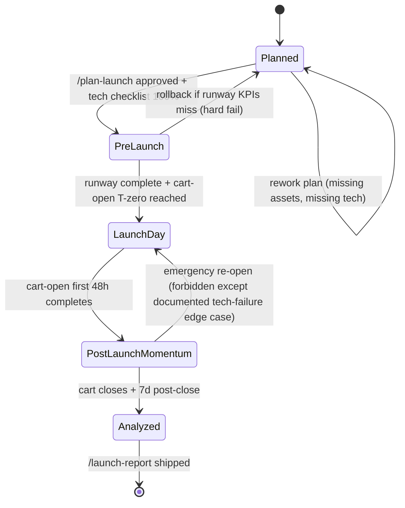

# Launch Pipeline — FSM

## Purpose
State machine governing a launch cycle. Each state enforces the 5-phase SOP. No state transitions forward without the prior phase's checklist complete.

## State Diagram

## State Definitions

### Planned
Launch plan being drafted. `/plan-launch` is running. All 5 phases sketched.
- **Entry:** founder / launch director initiates cycle
- **Produces:** `output/launch/launch-plan.md`
- **Exit gate:** tech checklist 100%, asset inventory 100%, all Phase-1 deliverables ready, team RACI signed

### PreLaunch
Runway period (T-minus 14 to T-minus 1). Waitlist, lead-magnets, runway content, pre-launch webinars.
- **Entry:** plan approved
- **Daily cadence:** content, waitlist monitoring, open-rate checks
- **Exit gate:** runway KPIs met — waitlist growth, open-rate ≥ 35%, engagement on pre-launch content ≥ 1.2× baseline

### LaunchDay
Cart-open Day 0 through 48h Open-Cart Frenzy. The highest-intensity state.
- **Entry:** T-zero reached + all systems green
- **Monitoring cadence:** hourly funnel metrics check first 8h, every 4h next 40h
- **Exit:** 48h mark reached
- **Emergency gate:** if checkout / funnel breaks for > 30 min, rollback halts cart; communications pre-drafted

### PostLaunchMomentum
Dead Middle through Cart-Close. Daily scheduled spikes, objection-handling, SCA recovery.
- **Entry:** 48h Open-Cart completes
- **Daily cadence:** 1 email/day minimum, 1 scheduled spike/day (testimonial, Q&A, bonus, deadline push)
- **Exit:** cart closes at midnight of Day N (no extension)

### Analyzed
`/launch-report` runs. Revenue attribution, CVR analysis, lessons documented.
- **Entry:** cart closes + 7 days (to let SCA recovery + refunds settle)
- **Produces:** `output/launch/launch-report-{cycle}.md`
- **Exit:** report published, lessons routed to foundations / marketing / nurture / sales departments, cycle archived

## Transition Rules
- **No-extension rule**: cart-close deadline is immutable. Any "emergency re-open" must be documented and approved by founder — exercising this option degrades future launch credibility.
- **Tech-checklist gate**: 100% of items in `reference/knowledge/launch.md` tech checklist must pass. Partial completion does not transition Planned → PreLaunch.
- **Runway KPI gate**: missing runway KPIs triggers rollback — a cold launch burns audience trust more than a delayed launch does.
- **Rollback to Planned**: allowed during PreLaunch only. After LaunchDay, forward-only.
- **Post-mortem is mandatory**: every launch writes a report. No skip — compounding improvement requires the documented review.

## 5-Phase Checklist (Gate Content)

### Phase 1 Planned → PreLaunch
- [ ] Offer finalized
- [ ] Funnel pages QA'd + load-tested
- [ ] Email sequences written (runway, daily-during, cart-close, SCA, post-purchase)
- [ ] Ad creative 20+ assets produced
- [ ] Tech checklist 100%
- [ ] Affiliate / JV partners briefed
- [ ] Customer service scripts ready
- [ ] Refund SOP in place

### Phase 2 PreLaunch → LaunchDay
- [ ] Waitlist > target size
- [ ] Pre-launch content shipped (2–3 flagship pieces)
- [ ] Webinar / live events executed
- [ ] Email open-rate ≥ 35%
- [ ] Engagement ≥ 1.2× baseline
- [ ] Final tech pass (cart, tracking, SMS, email)

### Phase 3 LaunchDay → PostLaunchMomentum
- [ ] Cart opened on-time
- [ ] Announcement emails + SMS + socials fired
- [ ] Live event ran (if planned)
- [ ] No unresolved tech incidents > 15 min
- [ ] 48h revenue hits floor (≥ 25% of target)

### Phase 4 PostLaunchMomentum → Analyzed
- [ ] 1 email/day sustained
- [ ] ≥ 1 scheduled spike/day
- [ ] SCA sequence running
- [ ] Retarget ads live
- [ ] Close-cart frenzy executed (3 emails + SMS in final 24h)
- [ ] Midnight close honored

### Phase 5 Analyzed
- [ ] Revenue attributed
- [ ] CVR by step reported
- [ ] CAC calculated
- [ ] SCA recovery reported
- [ ] Lessons routed to departments

## KPIs Emitted per Cycle
- Launch CVR (target: ≥ 2%)
- CAC (target: ≤ 1/3 offer price)
- Open-Cart 48h revenue share (target: 30–40%)
- Close-Cart 24h revenue share (target: 40–50%)
- SCA recovery (target: ≥ 15%)
- Refund rate (target: ≤ 5%)
- NPS Day-7 (target: ≥ 50)

## Cross-references
- Knowledge: `reference/knowledge/launch.md`
- Skills: `skills/plan-launch/`, `skills/launch-report/`
- Upstream: `workflows/divisions/sales-pipeline.md` (funnel + VSL)
- Integration: `workflows/divisions/marketing-pipeline.md` (creative), `workflows/divisions/nurture-pipeline.md` (sequences), `workflows/divisions/partnerships-pipeline.md` (JV timing)

---
*v1.0 — 2026-04-19.*
