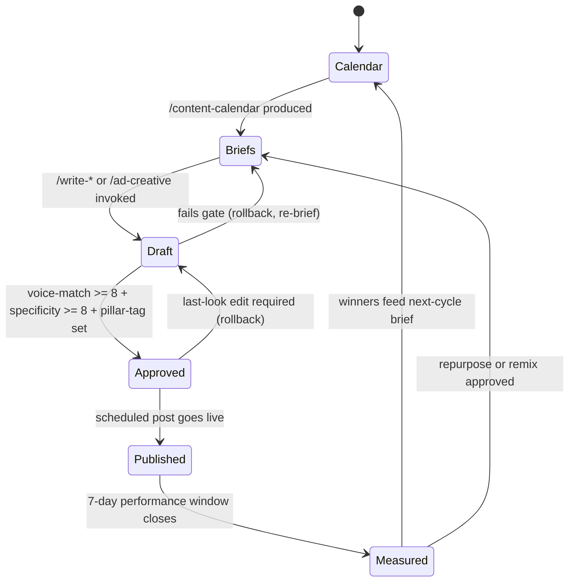

# Marketing Pipeline — FSM

## Purpose
State machine governing the Marketing department's weekly-to-monthly content cycle. Transitions enforce the 40/30/20/10 pillar distribution, voice-match ≥ 8, specificity ≥ 8 before publish.

## State Diagram

## State Definitions

### Calendar
Empty or expired content plan. Nothing scheduled for the upcoming window.
- **Entry:** new month begins OR previous cycle's Measured state completes
- **Exit:** `/content-calendar` invoked

### Briefs
Monthly calendar authored — 40% pillar content, 30% authority, 20% conversion, 10% experimental. Per-post briefs created for each slot.
- **Entry:** `/content-calendar` skill runs
- **Produces:** `output/marketing/calendar-{month}.md` + `output/marketing/briefs/{slot-id}.md`
- **Exit gate:** every slot has a brief with: pillar tag, hook, belief-dissolved, CTA, specificity targets

### Draft
Active writing. One of the skill outputs: `/write-reel`, `/write-youtube`, `/write-linkedin-post`, `/write-x-thread`, `/story-sequence`, `/ad-creative`.
- **Entry:** writer picks up a brief
- **Produces:** `output/marketing/drafts/{slot-id}.md`
- **Exit gate:** voice-match ≥ 8, specificity ≥ 8, pillar-tag present, hook density met, CTA present

### Approved
Editor has accepted draft. Scheduled for publication.
- **Entry:** draft passes gate
- **Exit:** scheduled post fires OR rollback if pre-publish edit is required

### Published
Live on platform. Performance window is open.
- **Entry:** platform confirms post live
- **Exit:** 7 days elapsed OR early-remove for underperformance

### Measured
Post-performance window closed. Engagement, reach, conversion tagged. Winners flagged for repurpose.
- **Entry:** 7-day performance window closes
- **Produces:** `output/marketing/performance/{slot-id}-report.md`
- **Exit:** either back to `Calendar` (next cycle) or back to `Briefs` (remix approved)

## Transition Rules
- **Pillar ratio enforcement**: any calendar with a skew > ±10% from 40/30/20/10 rejects automatically.
- **Voice-match < 8**: draft cannot progress. Writer rewrites using voice-guide.md references.
- **Specificity < 8**: draft rejected. Need concrete numbers, names, dates, quotes.
- **Remix rule**: any post in top quintile by engagement is auto-queued for repurpose in the next cycle (max 3 per month).
- **Kill rule**: any post in bottom decile is removed from repurpose pool and root-cause logged.

## Entry / Exit Side-Effects
- Every draft links to its brief
- Every published post carries UTM with campaign = cycle-tag
- Every measured post writes a row to `output/marketing/performance-log.csv`
- Failed drafts archived in `output/marketing/_failures/{date}-{slot}.md`

## 40/30/20/10 Pillar Distribution
| Pillar | Ratio | Purpose |
|---|---|---|
| 40% Pillar Content | Educate, teach, prove authority | Long-form SEO + value-first social |
| 30% Authority | Founder POV, contrarian takes, frameworks | LinkedIn posts, X threads, YouTube essays |
| 20% Conversion | Direct-response, case study, offer-adjacent | Ads, sales-content, testimonial posts |
| 10% Experimental | Format / channel / topic tests | New formats, trend-jacking, partnerships |

## Cadence Targets
- **Daily**: 1 short-form (reel / tweet / LinkedIn)
- **Weekly**: 1 long-form (YouTube / blog / newsletter), 1 thread
- **Monthly**: 1 pillar "flagship" piece + calendar re-plan

## KPIs Emitted
- Calendar-fill rate (target: 100%)
- Brief-to-draft time (target: ≤ 2 days)
- Draft-to-approval pass rate (target: ≥ 70% first-attempt)
- Publish adherence (target: 100% on scheduled day ± 2h)
- Engagement rate (platform-dependent; benchmark last 30d average, target ≥ 1.1×)
- Winners-per-cycle (target: ≥ 15% of posts in top quintile)

## Cross-references
- Knowledge: `reference/knowledge/marketing.md`, `reference/knowledge/foundations.md` (voice)
- Skills: `skills/content-calendar/`, `skills/write-reel/`, `skills/write-youtube/`, `skills/write-linkedin-post/`, `skills/write-x-thread/`, `skills/story-sequence/`, `skills/ad-creative/`
- Downstream: `workflows/divisions/nurture-pipeline.md` (lead capture feeds nurture), `workflows/divisions/sales-pipeline.md` (ads feed VSL)

---
*v1.0 — 2026-04-19.*
