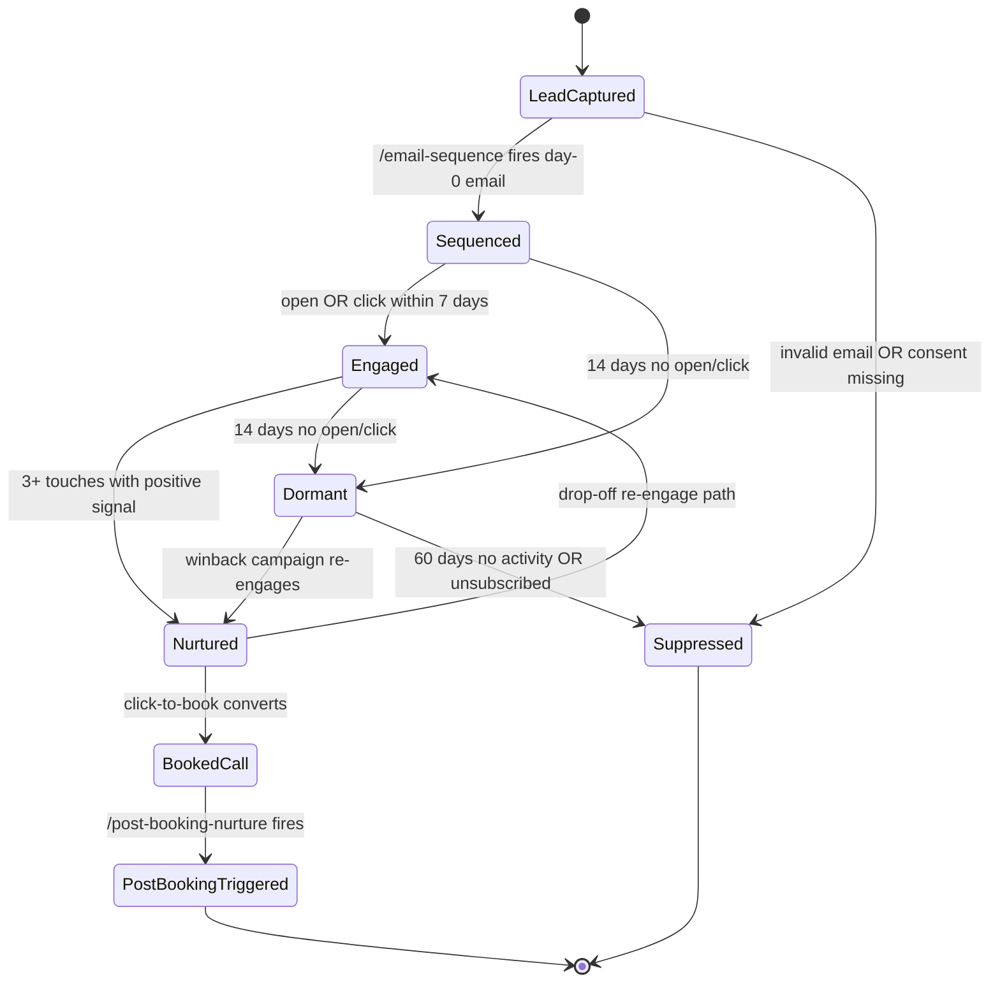

# Nurture Pipeline — FSM

## Purpose
State machine governing a lead's journey from capture through booked call. Every state has compliance checks and cadence rules. Failed compliance or extended inactivity triggers suppression, not re-entry.

## State Diagram

## State Definitions

### LeadCaptured
Email collected via lead-magnet, webinar opt-in, content upgrade, or organic list-build.
- **Entry:** form submit OR API lead push
- **Compliance gate:** double-opt-in (GDPR/CASL regions), consent log with timestamp + source + IP
- **Exit:** day-0 email fires within 3 minutes

### Sequenced
Inside an active email sequence — welcome (3–5 emails), indoctrination (7–10), nurture-to-offer (5–7).
- **Entry:** day-0 email sent
- **Produces:** per-email send log in ESP
- **Compliance gate:** every email has unsubscribe, physical address, sender identity

### Engaged
Lead has opened or clicked at least once within 7 days. Actively warm.
- **Entry:** first open / click detection
- **Exit signals:** sustained engagement → Nurtured; silence → Dormant

### Nurtured
Multi-touch engagement. Lead has been shown proof, mechanism, and belief-dissolving content. Ready for offer.
- **Entry:** ≥ 3 positive-signal touches (opens, clicks, replies, site visits)
- **Offer presented:** direct-buy link OR book-a-call CTA
- **Exit:** books call → BookedCall; ghosts → Engaged (with re-engagement offer)

### BookedCall
Calendar event created. Buyer intent confirmed.
- **Entry:** booking confirmation webhook fires
- **Automatic triggers:** confirmation email + SMS + calendar invite (see `automations/booking-to-show.md`)
- **Exit:** `/post-booking-nurture` fires next-state transition

### PostBookingTriggered
Pre-call nurture sequence active — 3–5 touches designed to raise show-rate and pre-frame the call.
- **Entry:** `/post-booking-nurture` skill invoked
- **Produces:** `output/nurture/post-booking-sequence-{lead-id}.md`
- **Exit gate:** call date reached OR reschedule OR no-show
- **Handoff:** on show, lead hands to sales-pipeline

### Dormant
No open / click for 14 days. Still subscribed, but cold.
- **Entry:** engagement silence threshold
- **Exit:** winback campaign → Nurtured OR inactivity threshold → Suppressed

### Suppressed
Removed from active sending — unsubscribed, marked spam, 60 days dormant, or invalid on capture.
- **Entry:** unsubscribe / hard-bounce / spam-complaint / 60d inactive
- **Compliance:** honored immediately; suppression list preserved per GDPR / CCPA
- **Exit:** user explicitly re-opts-in via new form submit → LeadCaptured

## Transition Rules
- **Consent is one-way**: any state can transition to Suppressed. Suppressed can only re-enter via explicit opt-in.
- **Show-rate target ≥ 65%**: if show-rate drops below 60%, `/post-booking-nurture` is reworked (more touches, SMS added, value-add pre-call).
- **Frequency cap**: max 1 email/day during Nurtured unless launch-mode. Max 2/day in launch window.
- **Compliance check runs on every send**: unsubscribe link present, sender identity, physical address. Send aborts on failure.
- **Winback cap**: dormant leads get max 1 winback sequence per quarter.

## Objection-Handling (inline, not stage)
Each sequence bakes in belief-dissolving content for the Limiting Belief Triad (won't work / can't do / not worth risk). Minimum 1 email per triad arm per 10-email sequence.

## Cadence Rules
| Stage | Touch Cadence |
|---|---|
| Welcome (days 0–4) | 1 email/day |
| Indoctrination (days 5–14) | Every other day |
| Nurture-to-offer (days 15–30) | 2/week |
| Post-booking | 2–3 touches in 48–72h before call |
| Winback | 3-email sequence across 7 days, 1/quarter max |

## KPIs Emitted
- Opt-in confirmation rate (target: ≥ 75% of captures confirm double-opt-in)
- Day-0 open rate (target: ≥ 55%)
- Sequence-to-nurtured conversion (target: ≥ 30%)
- Nurtured-to-booked conversion (target: ≥ 12%)
- Show-rate (target: ≥ 65%)
- Unsubscribe rate (target: ≤ 0.5% per send)
- Spam-complaint rate (target: ≤ 0.08%)

## Cross-references
- Knowledge: `reference/knowledge/nurture.md`
- Skills: `skills/email-sequence/`, `skills/lead-magnet/`, `skills/webinar-script/`, `skills/post-booking-nurture/`
- Automations: `workflows/automations/lead-to-crm.md`, `workflows/automations/booking-to-show.md`
- Downstream: `workflows/divisions/sales-pipeline.md` (call handoff)

---
*v1.0 — 2026-04-19.*
