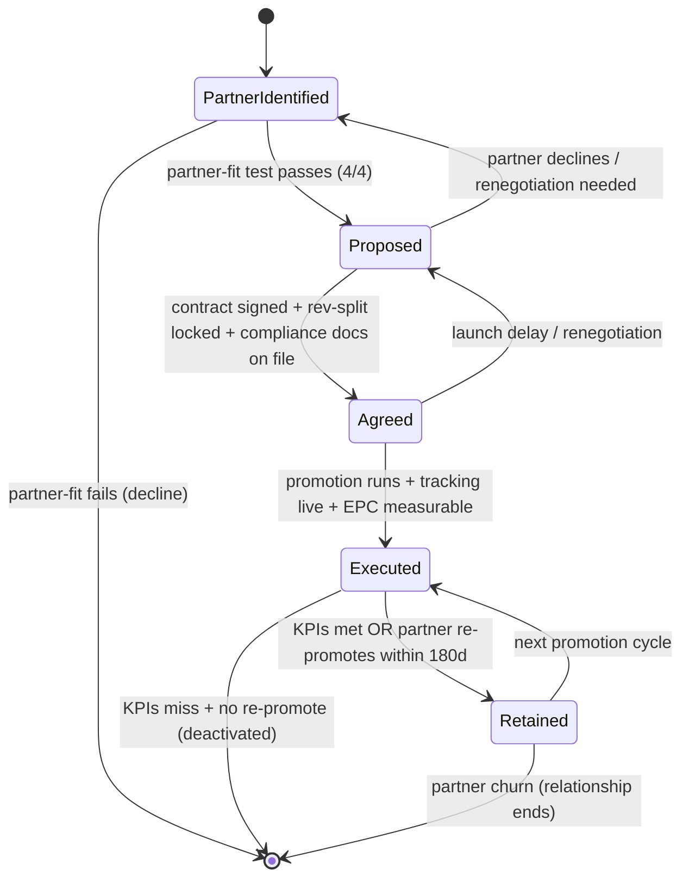

# Partnerships Pipeline — FSM

## Purpose
State machine governing the Partnerships department. Every partner progresses PartnerIdentified → Proposed → Agreed → Executed → Retained. Partner-fit test gates the entry; compliance gates every promotion.

## State Diagram

## State Definitions

### PartnerIdentified
Candidate surfaced — from founder network, customer referral, competitor-adjacent audience, or inbound inquiry.
- **Entry:** lead added to `output/partnerships/pipeline.csv`
- **Gate:** run partner-fit test (4 criteria: audience overlap ≥ 40%, non-competitive offer, brand alignment, reciprocity potential)
- **Exit:** 4/4 → Proposed; any fail → archive with reason

### Proposed
`/jv-webinar-proposal` OR `/affiliate-program` produces outreach document. Partner is in active negotiation.
- **Entry:** partner-fit passes
- **Produces:** `output/partnerships/proposals/{partner}.md`
- **Exit gate:** signed contract + W-9/W-8 + approved creatives + attribution method agreed

### Agreed
Contract signed. Tracking links generated. Launch window scheduled. Partner has promo assets.
- **Entry:** contract signed
- **Produces:** tracking UUIDs, swipe-file, approved creatives pack
- **Exit:** promotion window opens

### Executed
Live promotion window. Traffic flowing, attribution tracking, sales landing.
- **Entry:** first tracked click
- **Measurement window:** attribution window defined in contract (30/60/90d)
- **Exit gate:** KPIs met → Retained; clearly miss with no re-promote interest → deactivate

### Retained
Partner promotes ≥ 1 additional time within 180 days. Long-term relationship active.
- **Entry:** second promotion starts OR contract auto-renews
- **Loop:** each promotion cycles back through Executed
- **Exit:** relationship ends (mutual decision, drift, or contract termination)

## Transition Rules
- **4/4 partner-fit is mandatory**: failing any criterion blocks Proposed — even with strong short-term revenue upside. Bad partners damage brand.
- **Compliance-before-launch**: FTC disclosure language approved, GDPR/CAN-SPAM consent verified for partner list, tax forms on file. No launch without all three.
- **Internal EPC proof**: affiliate programs do not open to partners until internal EPC ≥ $1.00 proven on same funnel (prevents dud-promo partner churn).
- **Attribution redundancy**: cookie + server-side must both be live. Missing server-side → block launch.
- **Re-promote decision at 90d**: if partner's first promotion hits KPI thresholds, schedule next within 90 days while trust is high.

## Partner-Fit Test (Blocking Gate)
1. Audience overlap ≥ 40% (validated)
2. Offer non-competitive (adjacent, not substitute)
3. Brand-value alignment (tone, promises, standards)
4. Reciprocity potential (you can promote to them)

## Rev-Split Defaults (see scale / partnerships knowledge)
| Offer | Affiliate | JV |
|---|---|---|
| Info ($100–$2K) | 40–50% first | 50% first + 25% upsell |
| High-ticket ($3K+) | 20–30% first | 30–50% first |
| Services | 10–20% first | 15–25% first |
| SaaS | 20–30% recurring 12mo | 30% recurring 12mo |
| Referral (customer) | $100–500 flat OR 10% credit | N/A |

## Compliance Checklist (every promotion)
- [ ] FTC disclosure on all partner content
- [ ] Partner has consent for list promoted to (GDPR/CAN-SPAM/CASL)
- [ ] Only approved creatives in use
- [ ] Tracking verified client-side + server-side
- [ ] W-9 / W-8 on file for partners paid
- [ ] Contract signed (rev, window, exclusivity, termination)
- [ ] 1099-NEC calendar entry set (US, Jan)

## KPIs Emitted
- Partner EPC (target: ≥ $1 affiliate, ≥ $3 JV)
- JV webinar show-rate (target: ≥ 40%)
- JV webinar CVR (target: ≥ 5% registrants → buyer)
- Affiliate activation (target: ≥ 30% promote in first 30 days of approval)
- Partner retention (target: ≥ 70% re-promote within 180d)
- Referral rate (target: ≥ 15% of happy customers)
- Compliance incidents (target: 0)

## Cross-references
- Knowledge: `reference/knowledge/partnerships.md`
- Skills: `skills/jv-webinar-proposal/`, `skills/affiliate-program/`, `skills/referral-program/`
- Knowledge integration: `reference/knowledge/sales.md` (funnel), `reference/knowledge/nurture.md` (post-partner sequences), `reference/knowledge/launch.md` (JV timing)
- Agents: `agents/jv-outreach.md`, `agents/affiliate-architect.md`

---
*v1.0 — 2026-04-19.*
