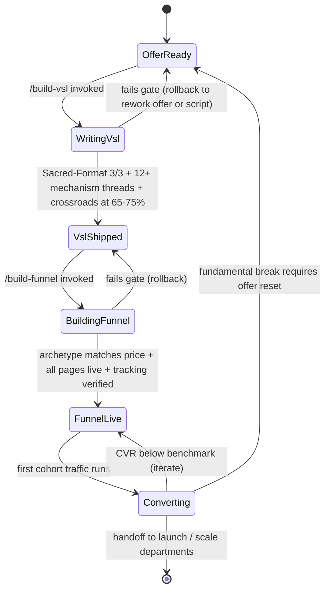

# Sales Pipeline — FSM

## Purpose
State machine governing the Sales department. The offer from Foundations becomes a VSL, the VSL becomes a funnel, and the funnel becomes recurring conversion. Each state has a gate that enforces the Sacred-Format 3/3 and mechanism-threading rules.

## State Diagram

## State Definitions

### OfferReady
Foundations department has shipped `offer.md` with Value Equation ≥ 150.
- **Entry:** foundations-pipeline completes
- **Input required:** offer.md, voice-guide.md, positioning.md, icp.md
- **Exit:** `/build-vsl` invoked

### WritingVsl
Script being drafted. One of the 5 variants selected based on offer + audience.
- **Entry:** `/build-vsl` skill runs
- **Produces:** `output/sales/vsl-script.md`
- **Exit gate:** 3 proof blocks + 3 stakes-raises + 3 belief-dissolutions + ≥ 12 mechanism threads + crossroads at 65–75% mark + voice-match ≥ 8

### VslShipped
Script approved and (optionally) recorded. Ready to be plugged into a funnel.
- **Entry:** script passes gate
- **Exit:** `/build-funnel` invoked

### BuildingFunnel
Funnel archetype selected, pages built, emails connected, tracking instrumented.
- **Entry:** `/build-funnel` skill runs
- **Produces:** `output/sales/funnel-map.md` + page inventory
- **Exit gate:** archetype matches price band; all pages live with Core Web Vitals green; pixel + server-side tracking verified; SCA sequence wired

### FunnelLive
Funnel published. Awaiting traffic or running traffic without performance data yet.
- **Entry:** funnel QA passed
- **Exit:** first cohort of 500+ visitors reaches offer → Converting

### Converting
Active funnel with enough data to measure. Iteration window.
- **Entry:** ≥ 500 visitors reached (statistical significance floor)
- **Exit gate:** either meets all CVR benchmarks → `[*]` (handoff), OR fails benchmark → rollback
- **Rollback paths:**
  - Single-step CVR below benchmark → back to `FunnelLive` (iterate that step)
  - Offer-level break (cold traffic can't grasp offer, multi-step decline) → back to `OfferReady` (foundation-reset)

## Transition Rules
- **Sacred-Format 3/3 is non-negotiable**: if any VSL has < 3 of any block, script does not ship.
- **Mechanism-thread minimum**: 12 threads for 20-min VSL, scaled linearly (6 threads for 10-min, 18 for 30-min).
- **Crossroads placement**: runtime check — if crossroads lands outside 65–75% mark, auto-fail.
- **Archetype-price match**: funnel archetype rules block mismatched builds (e.g., Archetype 4 "Application Funnel" blocked for offers < $3K).
- **Statistical floor**: no conversion verdict before 500 visitors per step.
- **Iteration budget**: Converting state allows 3 iteration rounds. 4th rollback triggers offer-reset.

## CVR Benchmarks (per funnel step)
| Step | Benchmark | Action if below |
|---|---|---|
| Cold → Lead | ≥ 25% | Rework landing page, headline, lead-magnet |
| Lead → VSL-watch (to crossroads) | ≥ 35% | Rework hook, opening 2 min, email sequence |
| VSL → Call-book OR direct-buy | ≥ 2% (direct) / 10% (call) | Rework crossroads, close, guarantee |
| Call → Close | ≥ 20% | Rework sales-call SOP, pre-call nurture, objection docs |
| SCA recovery | ≥ 15% | Rework SCA email sequence + SMS |

## Entry / Exit Side-Effects
- Every state writes to `workflows/operations/ledger.jsonl`
- Script failures archived in `output/sales/_failures/`
- Funnel pages tagged with version + cycle-id for A/B history
- Converting-state rollback to OfferReady requires written rationale in `output/sales/offer-reset-{date}.md`

## KPIs Emitted
- Time-in-state (target: WritingVsl ≤ 5d, BuildingFunnel ≤ 10d, FunnelLive → Converting ≤ 14d)
- VSL watch-to-crossroads rate (target: ≥ 35%)
- Funnel EPC (target: ≥ $1.50)
- Iteration count before Converting handoff (target: ≤ 2 rounds)
- Offer-reset frequency (target: ≤ 1 per offer per year)

## Cross-references
- Knowledge: `reference/knowledge/sales.md`, `reference/knowledge/foundations.md`
- Skills: `skills/build-vsl/`, `skills/build-funnel/`
- Upstream: `workflows/divisions/foundations-pipeline.md`
- Downstream: `workflows/divisions/launch-pipeline.md`, `workflows/divisions/scale-pipeline.md`
- Nurture integration: `workflows/divisions/nurture-pipeline.md`

---
*v1.0 — 2026-04-19.*
