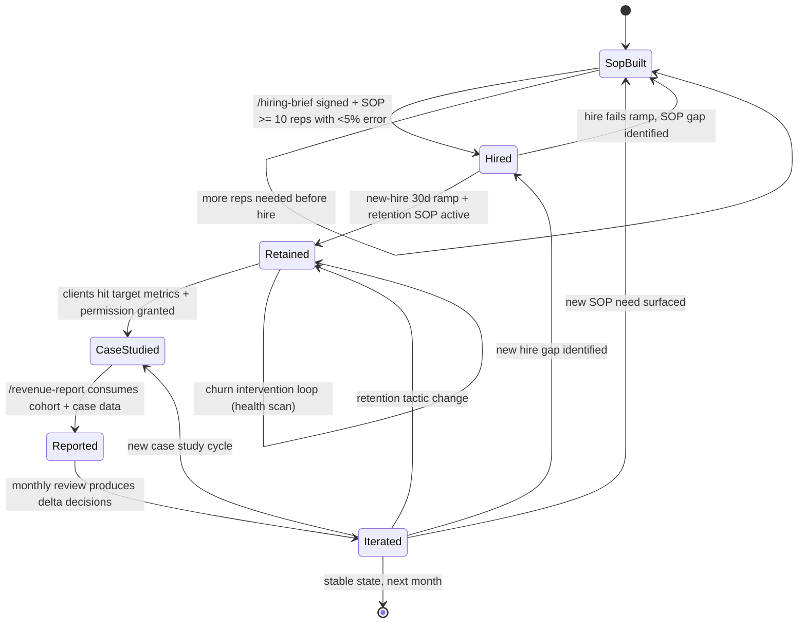

# Scale Pipeline — FSM

## Purpose
State machine governing the Scale department's operational loop. Each state's entry is a the VSL director-revenue-threshold-gated trigger. Scale is a loop — not linear — because SOPs, hires, retention, case studies, competitor intel, and revenue reports iterate continuously.

## State Diagram

## State Definitions

### SopBuilt
`/build-sop` has produced or updated an SOP. SOP is being executed by the owner.
- **Entry:** task repeated ≥ 3 times OR complexity threshold hit
- **Produces:** `output/scale/sops/{process}.md`
- **Exit gate:** SOP executed 10+ times with < 5% error rate AND reviewed by 2 operators

### Hired
New headcount added — `/hiring-brief` produced the role scorecard, offer extended, onboarding begun.
- **Entry:** SOP validated AND revenue-threshold permits (see the VSL director table in `reference/knowledge/scale.md`)
- **Produces:** `output/scale/hires/{role}.md` (scorecard, 30/60/90 plan)
- **Exit gate:** new hire ships first deliverable within 30 days + passes scorecard check

### Retained
`/retention-check` runs on cadence (weekly health scan, monthly QBR). the operations director 60/30/10 allocation active.
- **Entry:** customers onboarded OR renewal cycle opens
- **Produces:** `output/scale/retention/health-{period}.md`
- **Exit gate:** monthly churn ≤ 5%, NRR ≥ 110%
- **Loop:** if health-score drops ≥ 2 tiers, CS intervention fires within 48h; state stays in Retained

### CaseStudied
Client hit target result, permission granted, `/case-study` produces documented win.
- **Entry:** client hits target metric (pre-agreed threshold)
- **Produces:** `output/scale/case-studies/{client}-{offer}.md`
- **Exit gate:** verified metrics (screenshot + signed quote), before/during/after structure, 3 quotes minimum, usage rights signed

### Reported
`/revenue-report` runs monthly (by Day 5). Incorporates cohort view, NRR, CAC, LTV, case-study pipeline.
- **Entry:** month close Day 1
- **Produces:** `output/scale/reports/revenue-{month}.md`
- **Exit gate:** full P&L, cohort, forecast delivered to founder by Day 5

### Iterated
Monthly review loop. `/competitor-intel` (quarterly) + revenue report + retention data drive next-month decisions.
- **Entry:** revenue report published
- **Produces:** `output/scale/iterations/{month}-decisions.md` (what to build / hire / change)
- **Exit:** each decision routes back to appropriate state

## Transition Rules
- **the VSL director gates are hard**: cannot enter Hired if revenue-threshold not met (prevents structural burn).
- **SOP-before-hire**: no hire without documented SOP the hire will execute.
- **Case-study verification**: no case study without verified metric. Testimonials alone do not promote to CaseStudied.
- **the operations director reallocation**: if churn > 5%, Retained state auto-shifts to 40/50/10 allocation until stabilized.
- **Competitor-intel cadence**: `/competitor-intel` runs every 90 days per tracked competitor; overdue intel blocks Iterated decisions on positioning changes.
- **Loop frequency**: full SopBuilt → Iterated loop completes monthly for stable offers, weekly during scaling sprints.

## Quarterly Additions
- Full competitor intel refresh on top 5 competitors
- QBR with each key client
- Hiring plan revision (next-quarter roles)
- Org-chart review
- Pricing pressure-test

## KPIs Emitted
- Monthly churn (≤ 5%)
- NRR (≥ 110%)
- SOP coverage (≥ 80% of recurring tasks)
- Time-to-first-win per hire (≤ 30d)
- Case studies / month (≥ 1 per core offer)
- Competitor intel freshness (≤ 90d per competitor)
- Revenue report cadence (monthly Day 5)
- Gross margin (≥ 60% services, ≥ 80% info)

## Entry / Exit Side-Effects
- Every state transition logs to `workflows/operations/ledger.jsonl`
- Retention health-scans produce a per-customer row in `output/scale/retention/log.csv`
- Hire-fail triggers post-mortem at `output/scale/hires/_post-mortems/`
- Monthly reports archive in `output/scale/reports/`

## Cross-references
- Knowledge: `reference/knowledge/scale.md`
- Skills: `skills/build-sop/`, `skills/hiring-brief/`, `skills/retention-check/`, `skills/case-study/`, `skills/competitor-intel/`, `skills/revenue-report/`
- Onboarding integration: `workflows/client-onboarding/week-1.md`, `workflows/client-onboarding/90-day.md`
- Delivery integration: `workflows/delivery/4-week-fulfillment.md`
- Templates: `workflows/execution-templates/client-qbr-template.md`, `workflows/execution-templates/weekly-review-template.md`

---
*v1.0 — 2026-04-19.*
